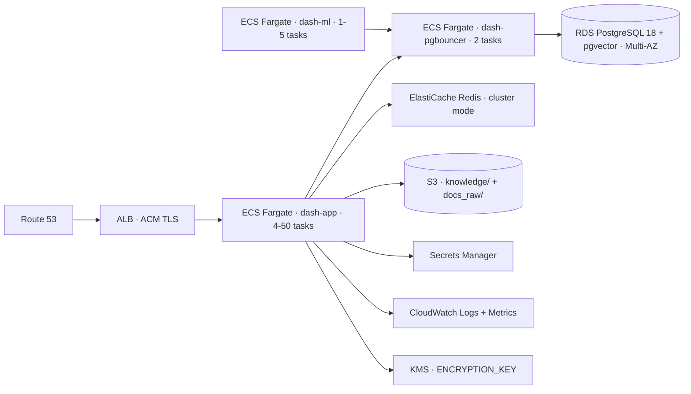

# DEPLOYMENT_AWS.md

> **⚠ Advanced / enterprise reference.** Dash runs fine for typical loads (≈200 users, single tenant) on a single Docker Compose host — see `DEPLOYMENT.md`. The K8s/Helm/multi-cloud setup below is optional and only needed for multi-replica horizontal scaling, which most deployments never require. Not exercised in the default deploy path.

> Deploy Dash on AWS. Companion to `DEPLOYMENT.md`.
> _Last verified: 2026-05-05 (template — adjust for your account specifics)._

## Target architecture



## Service mapping

| Compose service | AWS service |
|-----------------|-------------|
| `dash-app` | ECS Fargate task (CPU 2 vCPU, mem 4 GB) |
| `dash-pgbouncer` | ECS Fargate task (CPU 0.5 vCPU, mem 1 GB) |
| `dash-ml` | ECS Fargate task (CPU 2 vCPU, mem 1 GB cap, single replica per heavy job) |
| `dash-db` | RDS PostgreSQL 18 with `pgvector` extension |
| Caddy auto-SSL | ALB + ACM (managed certs) |
| Local volumes | S3 buckets (`knowledge`, `docs-raw`) + EFS for transient |

## Prerequisites

- AWS account with `ec2`, `ecs`, `rds`, `elasticache`, `s3`, `secretsmanager`, `kms`, `iam`, `cloudwatch` IAM rights.
- VPC with at least 2 private subnets (RDS Multi-AZ) + 2 public subnets (ALB).
- ECR repository `dash` (push the `dash-app` and `dash-ml` images).
- Domain in Route 53 (or external DNS).
- ACM certificate for `dash.yourdomain.com` issued in same region as ALB.

## RDS PostgreSQL setup

```bash
# 1. Create parameter group enabling pgvector
aws rds create-db-parameter-group \
  --db-parameter-group-name dash-pg18 \
  --db-parameter-group-family postgres18 \
  --description "Dash Postgres 18 + pgvector"

aws rds modify-db-parameter-group \
  --db-parameter-group-name dash-pg18 \
  --parameters "ParameterName=shared_preload_libraries,ParameterValue=pgvector,ApplyMethod=pending-reboot" \
               "ParameterName=idle_in_transaction_session_timeout,ParameterValue=60000,ApplyMethod=immediate" \
               "ParameterName=statement_timeout,ParameterValue=120000,ApplyMethod=immediate" \
               "ParameterName=password_encryption,ParameterValue=scram-sha-256,ApplyMethod=immediate"

# 2. Create DB instance (Multi-AZ recommended for production)
aws rds create-db-instance \
  --db-instance-identifier dash-db \
  --db-instance-class db.t4g.large \
  --engine postgres \
  --engine-version 18 \
  --allocated-storage 100 \
  --master-username ai \
  --master-user-password "$(aws secretsmanager get-random-password --output text)" \
  --multi-az \
  --backup-retention-period 7 \
  --db-parameter-group-name dash-pg18 \
  --storage-encrypted \
  --kms-key-id alias/aws/rds

# 3. After it boots:
psql -h dash-db.xxx.rds.amazonaws.com -U ai -d ai -c "CREATE EXTENSION IF NOT EXISTS vector;"
```

## ElastiCache Redis (optional, for shared rate limiting)

```bash
aws elasticache create-replication-group \
  --replication-group-id dash-redis \
  --replication-group-description "Dash rate limiter cache" \
  --engine redis \
  --cache-node-type cache.t4g.small \
  --num-node-groups 1 \
  --replicas-per-node-group 1 \
  --automatic-failover-enabled \
  --transit-encryption-enabled \
  --at-rest-encryption-enabled
```

## S3 buckets

```bash
aws s3api create-bucket --bucket dash-knowledge --region us-east-1 \
  --create-bucket-configuration LocationConstraint=us-east-1
aws s3api put-bucket-encryption --bucket dash-knowledge \
  --server-side-encryption-configuration \
  '{"Rules":[{"ApplyServerSideEncryptionByDefault":{"SSEAlgorithm":"AES256"}}]}'
aws s3api put-bucket-versioning --bucket dash-knowledge \
  --versioning-configuration Status=Enabled

# Same for docs-raw
```

Mount via S3 Mountpoint or sync via CRON; or refactor `app/upload.py` paths to use `boto3` directly (preferred for cloud-native).

## Secrets Manager

```bash
aws secretsmanager create-secret --name dash/openrouter-key \
  --secret-string "sk-or-v1-xxxx"

aws secretsmanager create-secret --name dash/db-pass \
  --secret-string "$(openssl rand -base64 32)"

aws secretsmanager create-secret --name dash/keycloak-client-secret \
  --secret-string "..."
```

ECS task definition references via `secrets:` block (env-var injection at boot).

## ECS task definitions (key fields)

`dash-app` task definition essentials:

```jsonc
{
  "family": "dash-app",
  "networkMode": "awsvpc",
  "requiresCompatibilities": ["FARGATE"],
  "cpu": "2048",
  "memory": "4096",
  "executionRoleArn": "arn:aws:iam::ACCOUNT:role/ecsTaskExecutionRole",
  "taskRoleArn": "arn:aws:iam::ACCOUNT:role/dash-task-role",
  "containerDefinitions": [{
    "name": "dash-app",
    "image": "ACCOUNT.dkr.ecr.us-east-1.amazonaws.com/dash:latest",
    "portMappings": [{"containerPort": 8000, "protocol": "tcp"}],
    "environment": [
      {"name": "DB_HOST", "value": "dash-pgbouncer.dash.local"},
      {"name": "DB_USER", "value": "ai"},
      {"name": "DB_DATABASE", "value": "ai"},
      {"name": "WORKERS", "value": "8"},
      {"name": "CHAT_MODEL", "value": "google/gemini-3-flash-preview"},
      {"name": "DEEP_MODEL", "value": "openai/gpt-5.4-mini"},
      {"name": "LITE_MODEL", "value": "google/gemini-3.1-flash-lite-preview"}
    ],
    "secrets": [
      {"name": "OPENROUTER_API_KEY", "valueFrom": "arn:aws:secretsmanager:us-east-1:ACCOUNT:secret:dash/openrouter-key"},
      {"name": "DB_PASS",            "valueFrom": "arn:aws:secretsmanager:us-east-1:ACCOUNT:secret:dash/db-pass"}
    ],
    "logConfiguration": {
      "logDriver": "awslogs",
      "options": {
        "awslogs-group": "/ecs/dash-app",
        "awslogs-region": "us-east-1",
        "awslogs-stream-prefix": "ecs"
      }
    }
  }]
}
```

`dash-pgbouncer` task: separate task definition with the official `pgbouncer/pgbouncer` image, env from Secrets Manager, exposing port 5432. Use AWS Cloud Map (`dash-pgbouncer.dash.local`) for service discovery.

`dash-ml` task: similar to `dash-app`, image `dash-ml:latest`, mem 1024, depends on `dash-pgbouncer` Cloud Map entry.

## ECS service definitions

| Service | Task | Min | Max | Target |
|---------|------|----:|----:|--------|
| dash-app | dash-app | 4 | 50 | CPU 70% |
| dash-pgbouncer | dash-pgbouncer | 2 | 4 | CPU 50% |
| dash-ml | dash-ml | 1 | 5 | manual scale |

ALB target group on `dash-app:8000`, health check `/health`.

## ALB + ACM

```bash
aws acm request-certificate \
  --domain-name dash.yourdomain.com \
  --validation-method DNS

# After validation:
aws elbv2 create-load-balancer --name dash-alb \
  --subnets subnet-aaa subnet-bbb \
  --security-groups sg-xxx --scheme internet-facing

# Listener forwards to dash-app target group on port 8000
```

## IAM task role policy (minimum)

```jsonc
{
  "Version": "2012-10-17",
  "Statement": [
    {"Effect":"Allow","Action":["secretsmanager:GetSecretValue"],"Resource":"arn:aws:secretsmanager:*:*:secret:dash/*"},
    {"Effect":"Allow","Action":["s3:GetObject","s3:PutObject","s3:ListBucket","s3:DeleteObject"],"Resource":["arn:aws:s3:::dash-knowledge","arn:aws:s3:::dash-knowledge/*","arn:aws:s3:::dash-docs-raw","arn:aws:s3:::dash-docs-raw/*"]},
    {"Effect":"Allow","Action":["kms:Decrypt","kms:GenerateDataKey"],"Resource":"arn:aws:kms:*:*:key/your-key-id"},
    {"Effect":"Allow","Action":["logs:CreateLogStream","logs:PutLogEvents"],"Resource":"arn:aws:logs:*:*:log-group:/ecs/dash-*"}
  ]
}
```

## CloudWatch alarms (recommended)

| Alarm | Metric | Threshold |
|-------|--------|-----------|
| RDS CPU high | `CPUUtilization` | > 80% for 10 min |
| RDS connections | `DatabaseConnections` | > 80% of max |
| RDS storage | `FreeStorageSpace` | < 20% |
| ECS dash-app CPU | per-service CPU | > 70% sustained |
| ECS dash-app errors | task stops > 0 | any |
| ALB 5xx | `HTTPCode_ELB_5XX_Count` | > 10/min |
| ML worker stuck | task age | > 30 min single task |

## Backups

- RDS automated backups: 7-day retention (set above), point-in-time recovery.
- S3 versioning enabled for `knowledge` and `docs-raw`.
- Optional: cross-region snapshot replication (RPO ~1 day).

## Scaling tunables

| Symptom | Lever |
|---------|-------|
| Chat latency p95 high | Scale `dash-app` horizontally; bump `WORKERS` to 16 |
| 429 rate-limit errors | Bump `RATE_LIMIT` env; verify ElastiCache shared |
| RDS connection saturation | Scale `dash-pgbouncer` to 4 tasks; bump `default_pool_size` |
| ML jobs queueing | Scale `dash-ml` (max 5 concurrent) |
| Long uploads timing out | ALB idle timeout → 600s; `client_max_body_size` on app |

## Cost guardrails

- RDS Multi-AZ doubles DB cost; can run single-AZ in lower environments.
- Fargate cost ≈ $30-60 / task / month at baseline (vCPU + mem).
- ALB ≈ $20 / month + data.
- Secrets Manager $0.40 / secret / month.
- S3 + CloudWatch Logs negligible at small scale.

## Migration from on-prem Docker Compose

1. Stand up RDS + ECS in parallel.
2. Push images to ECR.
3. Run schema bootstrap by deploying `dash-app` once; let `Base.metadata.create_all()` create tables.
4. Restore SQL dump into RDS: `psql -h dash-db.rds.amazonaws.com ... < backup.sql`.
5. Sync `knowledge/` to S3.
6. Cut DNS to ALB.
7. Decommission on-prem.

## Related docs

- `DEPLOYMENT.md` — Compose-level deploy + env vars
- `DEPLOYMENT_GCP.md` — GCP variant
- `SECURITY.md` — Secrets Manager + KMS rotation
- `UPGRADE.md` — schema migration policy
