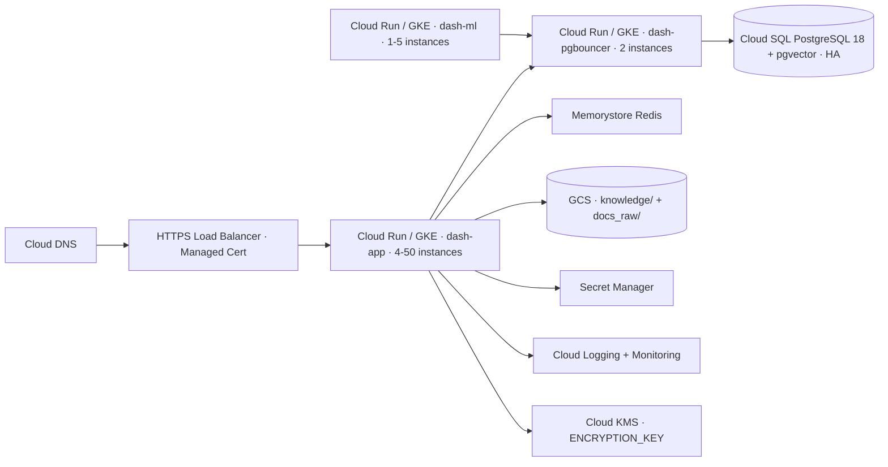

# DEPLOYMENT_GCP.md

> **⚠ Advanced / enterprise reference.** Dash runs fine for typical loads (≈200 users, single tenant) on a single Docker Compose host — see `DEPLOYMENT.md`. The K8s/Helm/multi-cloud setup below is optional and only needed for multi-replica horizontal scaling, which most deployments never require. Not exercised in the default deploy path.

> Deploy Dash on Google Cloud. Companion to `DEPLOYMENT.md`.
> _Last verified: 2026-05-05 (template — adjust for your project specifics)._

## Target architecture



## Service mapping

| Compose service | GCP service |
|-----------------|-------------|
| `dash-app` | Cloud Run (recommended) or GKE Deployment |
| `dash-pgbouncer` | Cloud Run sidecar or GKE Deployment |
| `dash-ml` | Cloud Run job (long-running) or GKE Deployment |
| `dash-db` | Cloud SQL for PostgreSQL 18 with pgvector flag |
| Caddy auto-SSL | HTTPS Load Balancer + Google-managed cert |
| Local volumes | Cloud Storage buckets (`knowledge`, `docs-raw`) |

## Prerequisites

- GCP project with billing enabled.
- APIs enabled: `run`, `sqladmin`, `redis`, `storage`, `secretmanager`, `cloudkms`, `compute`, `dns`, `logging`, `monitoring`.
- Artifact Registry repository `dash` (push `dash-app` and `dash-ml` images).
- Domain in Cloud DNS (or external).
- Service account with required roles (see IAM section).

## Cloud SQL setup

```bash
# 1. Create instance with pgvector flag
gcloud sql instances create dash-db \
  --database-version=POSTGRES_18 \
  --tier=db-custom-2-7680 \
  --region=us-central1 \
  --availability-type=REGIONAL \
  --storage-size=100GB \
  --storage-auto-increase \
  --backup-start-time=03:00 \
  --backup-location=us \
  --enable-point-in-time-recovery \
  --database-flags=cloudsql.enable_pgvector=on,idle_in_transaction_session_timeout=60000,statement_timeout=120000,password_encryption=scram-sha-256

# 2. Set root password
gcloud sql users set-password postgres --instance=dash-db --password="$(openssl rand -base64 32)"

# 3. Create app user + database
gcloud sql users create ai --instance=dash-db --password="$(openssl rand -base64 32)"
gcloud sql databases create ai --instance=dash-db

# 4. Connect and create extension
gcloud sql connect dash-db --user=postgres
# In psql: \c ai; CREATE EXTENSION IF NOT EXISTS vector;
```

## Memorystore Redis (optional, for shared rate limiting)

```bash
gcloud redis instances create dash-redis \
  --size=1 \
  --region=us-central1 \
  --tier=STANDARD_HA \
  --redis-version=redis_7_2 \
  --transit-encryption-mode=SERVER_AUTHENTICATION
```

## GCS buckets

```bash
gcloud storage buckets create gs://dash-knowledge \
  --location=US \
  --uniform-bucket-level-access \
  --default-encryption-key=projects/PROJECT/locations/global/keyRings/dash/cryptoKeys/dash-data

gcloud storage buckets update gs://dash-knowledge --versioning

# Same for dash-docs-raw
```

Mount via Cloud Storage FUSE (experimental) or refactor `app/upload.py` to use `google-cloud-storage` (preferred for cloud-native).

## Secret Manager

```bash
echo -n "sk-or-v1-xxxx" | gcloud secrets create dash-openrouter-key --data-file=-
echo -n "$(openssl rand -base64 32)" | gcloud secrets create dash-db-pass --data-file=-
echo -n "..." | gcloud secrets create dash-keycloak-client-secret --data-file=-
```

Reference in Cloud Run deploy via `--set-secrets`.

## Cloud Run deploy (dash-app)

```bash
# Build + push
docker build -t us-central1-docker.pkg.dev/PROJECT/dash/dash-app:latest .
docker push us-central1-docker.pkg.dev/PROJECT/dash/dash-app:latest

# Deploy
gcloud run deploy dash-app \
  --image=us-central1-docker.pkg.dev/PROJECT/dash/dash-app:latest \
  --region=us-central1 \
  --platform=managed \
  --service-account=dash-runtime@PROJECT.iam.gserviceaccount.com \
  --vpc-connector=dash-vpc-connector \
  --vpc-egress=private-ranges-only \
  --min-instances=4 \
  --max-instances=50 \
  --cpu=2 \
  --memory=4Gi \
  --concurrency=80 \
  --timeout=600s \
  --port=8000 \
  --no-allow-unauthenticated \
  --set-env-vars="DB_HOST=dash-pgbouncer,DB_USER=ai,DB_DATABASE=ai,WORKERS=8,CHAT_MODEL=google/gemini-3-flash-preview,DEEP_MODEL=openai/gpt-5.4-mini,LITE_MODEL=google/gemini-3.1-flash-lite-preview" \
  --set-secrets="OPENROUTER_API_KEY=dash-openrouter-key:latest,DB_PASS=dash-db-pass:latest"
```

For `dash-pgbouncer` and `dash-ml`: separate Cloud Run services with smaller resource specs (pgbouncer: 0.5 vCPU / 1 Gi; ml: 2 vCPU / 1 Gi).

## GKE alternative

If you prefer Kubernetes:

```bash
gcloud container clusters create dash \
  --region=us-central1 \
  --num-nodes=2 \
  --machine-type=e2-standard-4 \
  --enable-autoscaling --min-nodes=2 --max-nodes=20 \
  --enable-autorepair --enable-autoupgrade \
  --release-channel=regular \
  --workload-pool=PROJECT.svc.id.goog
```

Apply manifests from `k8s/` (when committed) — Deployments for `dash-app`, `dash-pgbouncer`, `dash-ml`, plus HPA, Ingress, cert-manager. Use Workload Identity to bind Pod service accounts to GCP service accounts (no JSON keys).

## HTTPS Load Balancer + Managed Cert

```bash
# Reserve global static IP
gcloud compute addresses create dash-ip --global

# Managed cert
gcloud compute ssl-certificates create dash-cert \
  --domains=dash.yourdomain.com \
  --global

# Backend, URL map, target proxy, forwarding rule (omitted brevity — use Terraform / Pulumi in prod)
```

If using Cloud Run only: Cloud Run has built-in HTTPS via `*.run.app`. Map custom domain via `gcloud beta run domain-mappings create`.

## IAM service account roles

| Role | Why |
|------|-----|
| `roles/cloudsql.client` | Connect to Cloud SQL via Cloud SQL Auth Proxy |
| `roles/secretmanager.secretAccessor` | Read secrets at boot |
| `roles/storage.objectAdmin` (scoped to buckets) | R/W `knowledge/` + `docs-raw/` |
| `roles/cloudkms.cryptoKeyEncrypterDecrypter` | KMS decrypt for ENCRYPTION_KEY |
| `roles/logging.logWriter` | Push logs |
| `roles/monitoring.metricWriter` | Push metrics |

## Cloud Logging + Monitoring

Cloud Run / GKE auto-ship logs to Cloud Logging. Define alerts:

| Alert | Metric | Threshold |
|-------|--------|-----------|
| Cloud SQL CPU | `cloudsql.googleapis.com/database/cpu/utilization` | > 80% / 10 min |
| Cloud SQL connections | `database/postgresql/num_backends` | > 80% of `max_connections` |
| Cloud Run latency | `request_latencies` p95 | > 5 s |
| Cloud Run errors | `request_count` 5xx | > 10/min |
| Cloud Run instance count | `instance_count` | > 80% of max |
| ML job stuck | custom log-based metric | task age > 30 min |

## Backups

- Cloud SQL automated backups + PITR (set above).
- GCS versioning enabled.
- Optional dual-region storage class for `knowledge` bucket (RPO ~minutes).

## Scaling tunables

| Symptom | Lever |
|---------|-------|
| Chat latency p95 high | Bump Cloud Run `--max-instances`; raise `WORKERS` to 16 |
| 429 rate-limit | Bump `RATE_LIMIT`; verify Memorystore shared |
| Cloud SQL connection saturation | Scale `dash-pgbouncer` Cloud Run min instances; bump `default_pool_size` |
| ML jobs queueing | Increase `dash-ml` `--max-instances` |
| Cloud Run cold start | Bump `--min-instances` (costs $) |

## Cost guardrails

- Cloud SQL HA roughly doubles DB cost.
- Cloud Run scales to zero when idle (default `--min-instances=0`); but cold start hurts UX. Recommend `min-instances=2` for `dash-app`.
- Memorystore HA tier ~$70/mo for 1 GB.
- GCS + Cloud Logging negligible at small scale.

## Migration from on-prem Docker Compose

1. Provision Cloud SQL + Cloud Run services in parallel.
2. Push images to Artifact Registry.
3. Deploy `dash-app` once → `Base.metadata.create_all()` bootstraps schema.
4. Restore dump: connect via Cloud SQL Auth Proxy + `psql ... < backup.sql`.
5. Sync `knowledge/` to GCS via `gsutil rsync`.
6. Map custom domain.
7. Decommission on-prem.

## Related docs

- `DEPLOYMENT.md` — Compose-level deploy + env vars
- `DEPLOYMENT_AWS.md` — AWS variant
- `SECURITY.md` — Secret Manager + KMS rotation
- `UPGRADE.md` — schema migration policy
